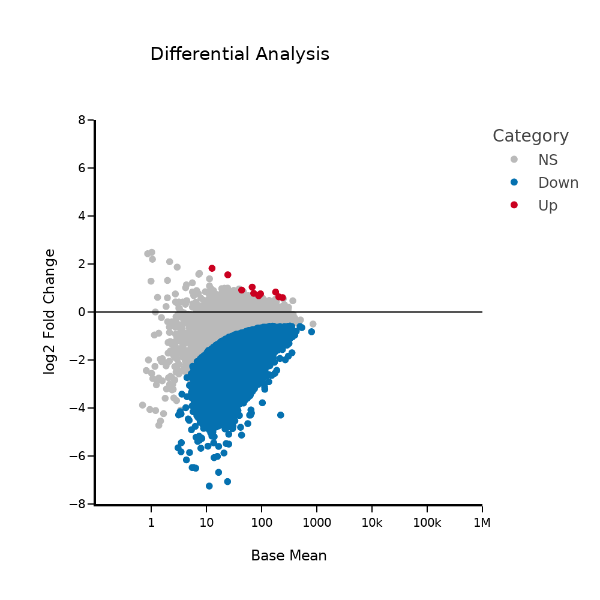

# Streamlit_MAplot
## This is a streamlit app to determine differential analysis of DESeq2 datasets and create a MA plot of the data. 

1. Upload the .txt file from DESeq2 output.
2. Create a unique name for the files
3. Select the adjusted p-value you want: 0.05 is what is typically recommended
4. Select the FoldChange you want to use when selecting the differentially changed genes or chromosomal locations.

5. Make sure the column names in your .txt file match what is in the log2FoldChange and padj, or change the column names in the app.

6. Select the column name you want to visualize on the .HTML plot, typically it would be gene_name or transcript id
7. Adjust any of the figure formating for your MA plot such as font size, number of ticks, image size, etc.

8. For the number of ticks on the y-axis (baseMean) here is the typical outcome for each number:
   * 1 = 101
   * 2 = 102
   * 3 = 103
   * 4 = 104
   * 5 = 105
   * 6 = 106
9. Run analysis and have fun!  
https://differentialanalysismaplot.streamlit.app/

###Example of a MA plot: 

